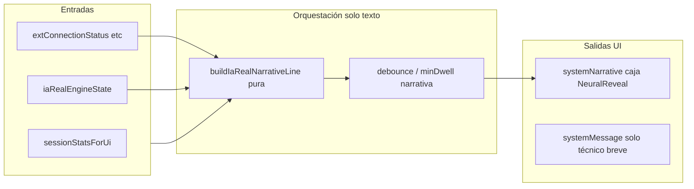

# Plan: narrativa única + cadencia fluida (sin rediseño)

## Contexto actual (referencias)

- **Caja de relato (“bonita”)**: bloque `motion.div` con `systemNarrative` y [`NeuralReveal`](apps/gpulse/src/App.jsx) (~6906–6962). Es el único sitio donde debe vivir el **texto narrativo** unificado.
- **Narrativa IA Real hoy**: [`buildRealNarrative`](apps/gpulse/src/App.jsx) solo distingue `SEÑAL` / `RESULTADO` con frases genéricas; **no** usa `iaRealEngineState.status` (p. ej. `SYNC` vs `WAITING_RESULT`, `RESULT_ANIMATION`).
- **Fases de presentación**: [`iaRealStatusToPresentationFase`](apps/gpulse/src/utils/iaRealEngineModel.js) colapsa varios `status` en `FASES` legacy para audio/HUD; `SEÑAL` agrupa `WAITING_RESULT` y `SYNC`.
- **Duplicación**: [`IaRealExecutionLayer.jsx`](apps/gpulse/src/components/iaReal/IaRealExecutionLayer.jsx) muestra texto de relato (“Listo · esperando…”, relay, “Sincronizando…”, “Esperando resultado…”) además de los **bloques de datos** (mesa, ronda, predicción, barra de progreso del vector, chips del forecast).
- **HUD**: [`GpulseSyncHUD`](apps/gpulse/src/App.jsx) recibe `message={systemMessage}`. Los efectos que actualizan `systemMessage` por `presentationFase` y por `syncMode` pueden **pisarse** entre sí ([~3368–3407](apps/gpulse/src/App.jsx)), y además repiten mensajes que el usuario quiere **solo** en la caja.

## Principios (acordados contigo)

1. **No rediseño**: no tocar clases, grid, tamaños de tarjetas, barra de pasos, chips P/B, tablas T1–T6 en [`IaRealMartingaleGrid`](apps/gpulse/src/components/iaReal/IaRealMartingaleGrid.jsx), ni el layout del dashboard.
2. **Un solo altavoz de relato**: todo lo que sea “notificación” o “relato” va a **`systemNarrative`** (misma caja, mismo `NeuralReveal`).
3. **Datos vs relato**: mesa, ronda, predicción/vector, barra “paso i / N”, cuadros y tabla martingala siguen siendo **solo datos**; no añadir nuevos bloques de texto fuera de la caja.

## Arquitectura propuesta

### 1) Función pura de una línea de relato IA Real

- Extraer (recomendado) a un util pequeño p. ej. [`apps/gpulse/src/utils/iaRealNarrativeLine.js`](apps/gpulse/src/utils/iaRealNarrativeLine.js) una función tipo `buildIaRealNarrativeLine({ status, activeRow, outcomeRow, visualStepIndex, connectionMeta, sessionSnapshot })` que devuelva **un string** por “momento” del ciclo:
  - `IDLE` + relay inestable → línea de enlace (una sola frase).
  - `SYNC` → alinear con “sincronización” (sin duplicar el HUD si no hace falta).
  - `WAITING_RESULT` → mesa, ronda, paso actual / vector (datos ya visibles arriba; el texto **refuerza** en una frase corta).
  - `RESULT_ANIMATION` / `SUCCESS` / `FAILED` → desenlace en una frase + opcional variación neta (ya tenéis `rewardsNet` en [`buildRealNarrative`](apps/gpulse/src/App.jsx)).
- Mantener **copys en español** y tono alineado con simulación (sin inventar cartas ni tiempos del proveedor).

### 2) Cablear el `useEffect` de narrativa en `App.jsx`

- Ampliar el efecto que llama a `buildNarrative` ([~3422–3451](apps/gpulse/src/App.jsx)):
  - Cuando `isIaRealProviderShell`, usar **`buildIaRealNarrativeLine`** (o ampliar `buildRealNarrative` con un branch que reciba el snapshot del motor) en lugar de solo `fase` + `activeShot`.
  - Dependencias: `iaRealEngineState` (status, activeRow, outcomeRow, visualStepIndex), `extConnectionStatus` / meta de relay ya pasada a la layer, `sessionStatsForUi`, y opcionalmente `presentationFase` solo como respaldo.
- **Importante**: `activeCycleMode` debe seguir siendo `IA_REAL` durante el shell para no caer en narrativa vacía.

### 3) Cadencia “milimétrica” sin inventar tiempos del proveedor

- Añadir un **debounce / tiempo mínimo entre dos cambios de `systemNarrative`** (p. ej. 280–450 ms) cuando `status` o `activeRow.id` cambien rápido, para evitar parpadeos del `NeuralReveal`.
- Opcional (segunda iteración): **cola de una sola línea** — si llegan dos eventos seguidos, la segunda reemplaza a la primera solo después del `minDwell` (misma caja, sin lista nueva).
- No añadir timers que retrasen **datos** en `IaRealExecutionLayer`; solo suavizar **el texto** de la caja.

### 4) Quitar relato duplicado fuera de la caja (sin rediseño)

- En [`IaRealExecutionLayer.jsx`](apps/gpulse/src/components/iaReal/IaRealExecutionLayer.jsx), introducir una prop **opcional** tipo `narrationSurface="inline" | "external"` (default `"inline"` para no romper otros usos) o `suppressStoryText`:
  - Con `suppressStoryText` (desde `App` cuando `isIaRealProviderShell`): **ocultar** los `
` que hoy cuentan la historia (relay, sincronizando, esperando resultado, idle copy), conservando **exactamente** los contenedores de mesa/ronda/predicción, barra y chips.
  - Para **accesibilidad**: donde se elimine texto visible, añadir `aria-label` en el `role="region"` ya existente con un resumen breve, o un `span` con `className="sr-only"` (no cambia el diseño visual).
- **No** mover bloques de layout ni alterar `framer-motion` salvo `opacity: 0` + `h-0` / `hidden` en líneas de texto si hace falta evitar huecos; preferir `sr-only` o altura fija mínima igual a la línea actual para cero salto.

### 5) HUD (`systemMessage`) vs caja

- Para shell IA: dejar `GpulseSyncHUD` con mensajes **cortos y técnicos** (sync / modo sync) **o** repetir una micro-etiqueta que no compita con el relato (p. ej. solo “Sync” + %).
- Resolver el **choque de efectos** entre el `switch (presentationFase)` y el efecto de `syncMode` ([~3368–3407](apps/gpulse/src/App.jsx)): en modo shell, **no** pisar `systemMessage` con frases narrativas (“Escaneando entorno…”) si esas frases pasan a la caja; el HUD puede mostrar solo estado de sync o un `message` fijo corto.

### 6) Pruebas

- Tests unitarios de `buildIaRealNarrativeLine` (tabla: `status` + inputs mínimos → string esperado), colocados junto a [`iaRealEngineModel.test.js`](apps/gpulse/src/utils/iaRealEngineModel.test.js) o archivo dedicado.

## Fuera de alcance (otra fase, como indicaste)

- Rediseño visual, nuevos iconos, cambiar la barra 1–N o el número de chips, animaciones nuevas en la caja, o cambiar `externalSignalsStore`.

## Criterios de aceptación

- En IA Real (provider shell), **toda frase narrativa** que antes aparecía en la layer o sonaba duplicada con el HUD está **solo** en la caja `systemNarrative`, salvo `sr-only` para lectores de pantalla.
- Los componentes de datos (mesa, ronda, predicción, barra, cuadros, grid historial en hub) **se ven igual** que ahora.
- Al recibir señales/resultados rápidos, el texto de la caja **no parpadea** de forma brusca (debounce perceptible).
